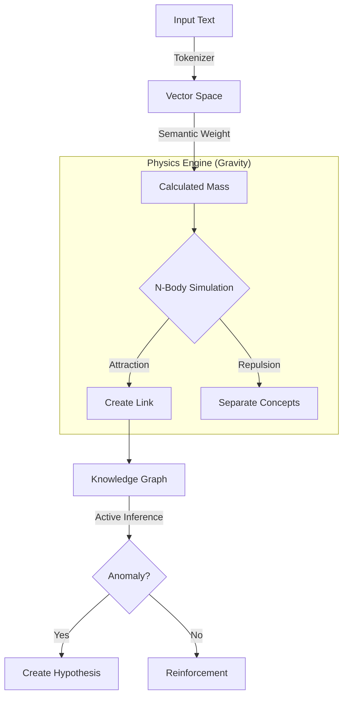

# GeneISys
### An Organic Neuro-Symbolic Engine based on Semantic Physics

[](https://opensource.org/licenses/MIT)
[](https://www.python.org/)
[]()

<p align="center">

</p>


**GeneISys** is an experimental AI engine developed through a "Vibe Coding" session with Gemini 3 Pro. It explores a radical alternative to Transformers: a **White Box**, **Continuously Learning** architecture where concepts interact as physical bodies in a semantic vector space.

> **Project Goal:** Demonstrate that complex, scalable, and auditable AI architectures can be rapidly conceptualized and prototyped through intuitive human-AI collaboration.

---

## 🧠 Key Features (Why GeneISys?)

Unlike static LLMs (Large Language Models), GeneISys focuses on dynamic topology:

* **🔍 White Box & Auditable:** Every decision flows from explicit physical interactions (gravity, mass, attraction). You can trace exactly *why* a connection was made via the Knowledge Graph.
* **🌱 Continuous Learning (Plasticity):** No massive pre-training phase required. The system learns in real-time ("Life Loop"), creating new memories and concepts on the fly.
* **⚡ Scalable Architecture:**
    * **Resolution:** Adjustable dimensions (tested from `64` to `4096`).
    * **Precision:** Supports `INT8`, `FP16`, and `FP32`.
    * **Optimization:** vectorized for CPU (Numba), GPU (CUDA), and Hybrid modes.
* **🛡️ Transparent Logic:** Embeds a "Narrative Architect" capable of explaining its own internal state without hallucinating reasoning.

---

## ⚠️ Disclaimer

**What GeneISys IS NOT:**
* It is **NOT an LLM** (like GPT-4 or Llama).
* It is **NOT pre-trained** on the internet. It starts "naked" and learns from what you feed it.
* It does **NOT** use backpropagation.

**Note on Language:**
This codebase reflects a "Vibe Coding" process aimed at rapid prototyping. Variable names and internal logic comments may act as a mix of English and French to facilitate the author's initial conceptualization.

### 🧬 Architecture Overview



---

## ⚙️ Installation

### Prerequisites
* **Python 3.12+** (Tested on 3.12.10)  [Donwload Python](https://www.python.org/downloads/)
* **CUDA 12.x** (Optional, for GPU acceleration. Tested on CUDA 12.8)

### Dependencies
Open a terminal in the project folder and install the required libraries:

```bash
pip install torch numpy tokenizers numba safetensors faiss-cpu lancedb pyarrow pandas orjson
```

### Required Files
For the engine to boot correctly, ensure these files are present in the **root directory** alongside `geneisys.py`:
* `genesis_curriculum_test.txt` (Critical for initial unit tests)
* `genesis_curriculum.txt` (For mass training mode)
* `fake_vectors.txt` (Optional, for import tests)

### Launch on windows
```bash
:: If Python is in your PATH:
python geneisys.py

:: If you downloaded the embedded package or have no PATH:
:: (Replace [path-to-python] with your actual folder, e.g., C:\Python312\)
[path-to-python]\python.exe geneisys.py
```

### Launch on Linux and MacOS
```bash
# If Python is in your PATH (Standard):
python3 geneisys.py

# If you need the absolute path (No Env Variables):
/usr/bin/python3 geneisys.py
```

---

## 🚀 Configuration & Usage

Open the `geneisys.py` file in your text editor. Scroll down to the bottom (`if __name__ == "__main__":`) to tweak the engine's DNA.

### Core Settings
| Variable | Description | Recommended / Tested |
| :--- | :--- | :--- |
| `Nb_DIM` | Semantic resolution (Vector Dimensions) | `64` to `4096` |
| `strPRECISION_MODE` | Calculation precision | `"FP32"` (Standard), `"FP16"` (GPU), `"INT8"` |
| `boolForceCPU` | Force CPU usage even if CUDA is present | `False` (Auto-detect) |
| `str_lang` | Language configuration | `"fr"` (Currently supported) |
| `boolResetBase` | **Wipe memory** at startup | `True` (Fresh start) / `False` (Persistence) |

### 🕹️ Run Modes (`RUN_MODE`)

Uncomment the mode you wish to run in the script:

1.  **`DIAGNOSTIC`** (Default)
    * Runs a full suite of unit tests (Physics, Logic, Memory, Dreaming).
    * *Perfect for checking system stability.*
2.  **`LIFE_LOOP`**
    * The engine runs autonomously. It gets "bored," gets curious, dreams, and interacts with you in the console.
3.  **`TRAINING_FILE`**
    * Mass ingestion of the text corpus (`genesis_curriculum.txt`) to build initial knowledge.
4.  **`IMPORT_MODEL`**
    * Surgical import of external vector data.
5.  **`INFERENCE`**
    * Interactive Chat Mode. Talk to GeneISys and ask questions like *"Comment est la voiture ?"*.

---

## 🖥️ Hardware & Performance Notes

This architecture is designed to be highly elastic, but physics simulations are demanding.

* **High-End Desktop:** Tested on **NVIDIA RTX 5080**.
    * *Result:* Extremely fast ingestion, real-time physics on 4096 dims.
* **Standard Laptop:** Tested on **Intel i5 8th Gen** (No GPU).
    * *Result:* Functional.
    * **⚠️ IMPORTANT for CPU Users:** In `DIAGNOSTIC` mode, you **must** comment out the massive stress test line inside the `def run_all(self)` function to avoid freezing your machine:
    ```python
    # self.test_massive_context_n9()  <-- Add a hash to disable this on laptops/CPU
    ```


---

## 🛠️ The Vibe Coding Methodology

**GeneISys** is not just an AI engine; it is also a case study in **"Vibe Coding" applied to System Engineering**. 

The goal was to test if a Human Project Manager + an LLM could build a complex, novel architecture from scratch without using traditional software engineering workflows (no complex IDE, no agents).

Here is the process used to build this engine in 10 days for the first release:

### 1. The Setup (Minimalist Constraint)
* **Tool:** Raw chat interface (Browser).
* **Model:** Gemini 3 Pro (Thinking).
* **Constraint:** **Single Monolithic File.** While unconventional, keeping the entire engine in one file allowed for injecting the *full context* back into the LLM at every prompt, ensuring logical consistency.

### 2. The Workflow (Managing Entropy)
* **Persona Injection:** The AI was assigned the role of a Senior Expert in Biology, Neuroscience, and Physics.
* **Strict TDD:** Every new feature required a corresponding "Diagnostic/Test" function immediately. The `DIAGNOSTIC` mode acts as the safety net against regressions.
* **Context Drift Management:** When the model started hallucinating or looping, I asked for a **"Status Report"** (What works, What is missing). Then, I would start a fresh chat context, injecting only the Baseline Code and the Report.

### 3. Human Role vs. AI Role
* **AI ( The Hands):** Handled the heavy lifting of CUDA vectorization and mathematical implementation.
* **Human (The Architect):** Focused on design decisions, preventing over-engineering, and enforcing the "White Box" philosophy. As the code grew, manual integration became necessary to perform code reviews and reject unnecessary complexity.

*This project demonstrates that "Vibe Coding" is not limited to simple web apps but can be used to prototype complex, low-level cognitive architectures.*


---

## 👤 Author & Context

* **Author:** Clément Cogné
* **Date:** 2025-11-28
* **Location:** Toulouse, France
* **Contact:** [LinkedIn Profile](https://www.linkedin.com/in/clement-cogne/)

*This is a personal hobby project shared for educational purposes to demonstrate the potential of Neuro-Symbolic AI. It is provided "as-is" without warranty.*

---
## 📚 Citation

If you use GeneISys in your research, please cite it using the following BibTeX entry:

```bibtex
@software{cogne2025geneisys,
  author = {Cogné, Clément},
  title = {GeneISys: An Organic Neuro-Symbolic Engine based on Semantic Physics},
  year = {2025},
  publisher = {GitHub},
  journal = {GitHub repository},
  howpublished = {\url{[https://github.com/clementcogne/GeneISys](https://github.com/clementcogne/GeneISys)}},
  commit = {main}
}

